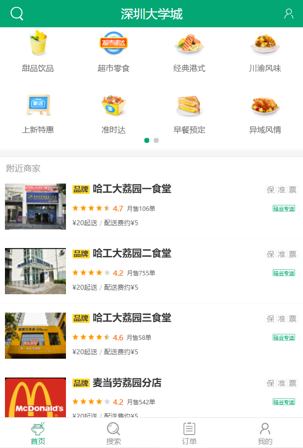
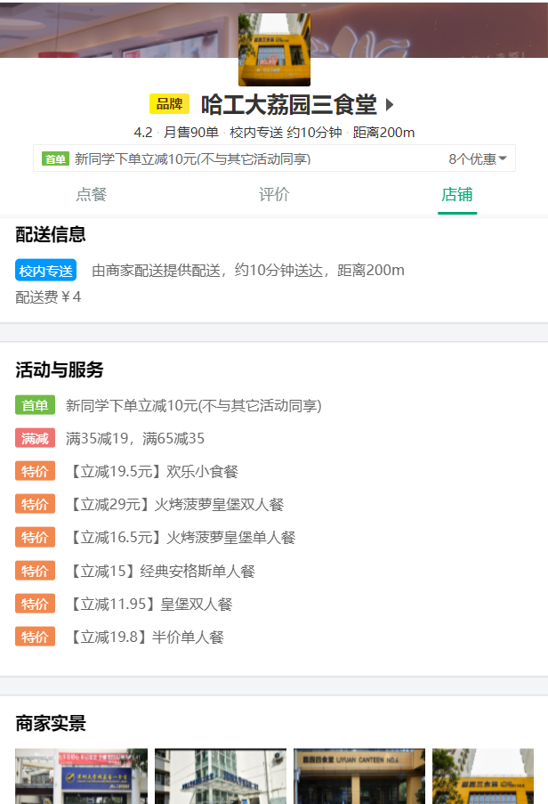
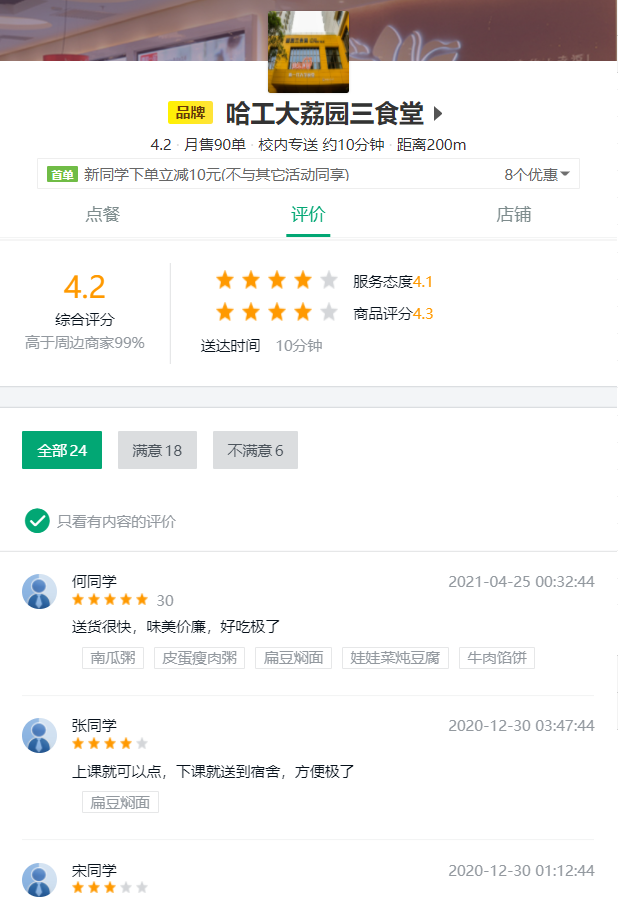
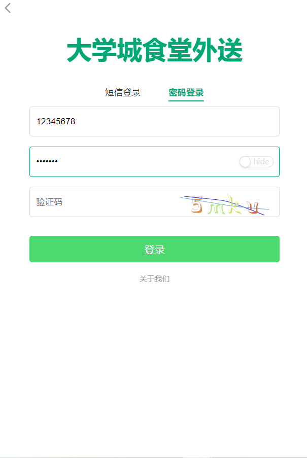
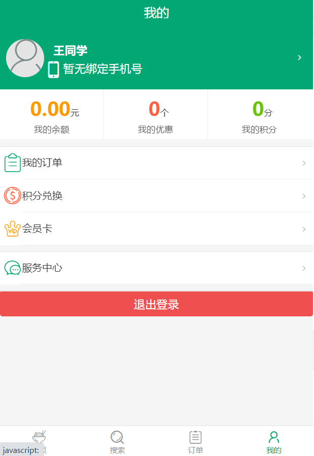
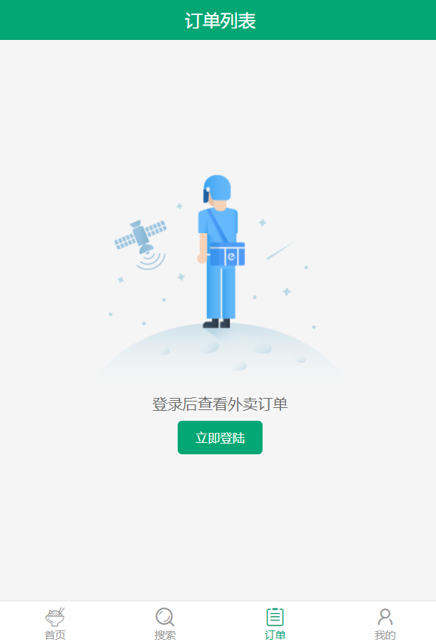
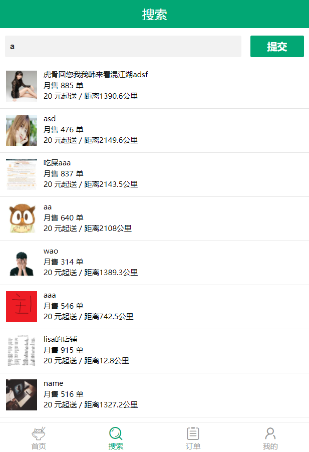
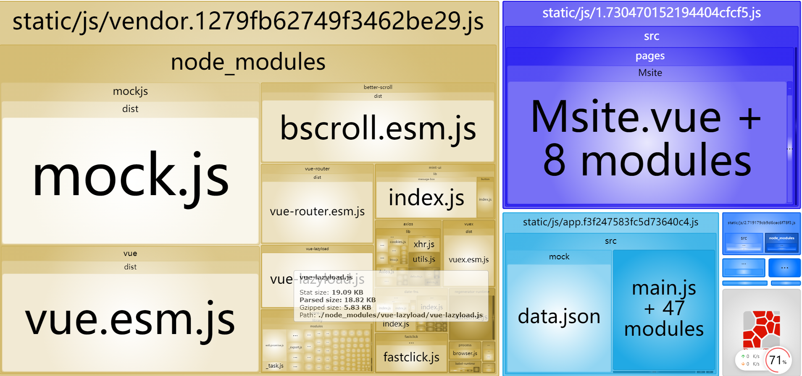

# 简介

## 项目概述

1. 此项目是一个前后端分离式的校园餐厅外送项目。

2. 基于Vue生态、ES6和Webpack等前端最新技术进行构建。

3. 项目包含商家、商品、购物车、用户等多个模块。

4. 涵盖商家展示、商家搜索、商品加购、用户登陆和注册等多种功能。

5. 展现了模块化、组件化、工程化的开发思想。


## 项目细节

#### 项目整体构建

1. vue-cli脚手架搭建项目，vue.js和es6语法进行整体项目构建。
2. vue-router实现路由管理和页面跳转，vuex进行组件状态管理。
3. 样式上使用css预处理器stylus及其变量、minxin等特性。
4. ajax,axios与后端进行数据交互，mockjs实现请求拦截和json数据模拟。
5. eslint进行代码规范管理，webpack进行打包构建。
6. 后端采用node.js和express进行构建，mongodb进行数据管理。

#### 相关插件和第三方库

1. better-scroll实现页面滑动效果。
2. Swiper库实现轮播图。
3. mint-ui组件库进行通知界面展示。
4. vue-lazyload实现图片懒加载。
5. css reset覆盖浏览器默认样式差异。
6. Fastclick解决点击事件300ms延迟的问题。

#### 项目结构

```
takeaway-client
├─ .babelrc  		//babel配置文件
├─ .editorconfig	//编辑器格式检查
├─ .eslintignore	//eslint忽略
├─ .eslintrc.js		//eslint检查配置
├─ .gitignore		//git忽略
├─ build			//webpack配置
├─ config			//webpack配置
├─ index.html		//主渲染页面
└─ static			//静态资源文件
├─ package-lock.json//包配置
├─ package.json		////包配置
```

```
src
├─ App.vue			//vue根组件
├─ api				//ajax封装和交互
│    ├─ ajax.js
│    └─ index.js
├─ common			//静态资源
│    ├─ imgs
│    └─ stylus
├─ components		//非路由组件
│    ├─ AlertTip	
│    ├─ CartControl
│    ├─ Food
│    ├─ FooterGuide
│    ├─ HeaderTop
│    ├─ ShopCart
│    ├─ ShopHeader
│    ├─ ShopList
│    └─ Star
├─ filters			//日期过滤器
│    └─ index.js
├─ main.js			//入口js
├─ mock			
│    ├─ data.json
│    └─ mockServer.js
├─ pages			//路由组件
│    ├─ Login
│    ├─ Msite
│    ├─ Order
│    ├─ Profile
│    ├─ Search
│    └─ Shop
├─ router			//路由配置			
│    └─ index.js
└─ store			//vuex配置
       ├─ actions.js
       ├─ getters.js
       ├─ index.js
       ├─ mutation-types.js
       ├─ mutations.js
       └─ state.js
```

#### API接口文档

[项目接口文档](https://github.com/liachang/Vue-Takeaway/blob/master/takeaway-server/API.md)


## 项目运行

```
git clone https://github.com/liachang/Vue-Takeaway.git
cd Vue-Takeaway
```

#### 客户端

```
cd takeaway-client
npm install
npm run dev
访问localhost:8080
```

#### 服务器

安装mongodb，并确保连接。

```
cd takeaway-server
npm install
npm start
```


## 项目展示

















#### webpack-bundle-analyzerd的分析结果




